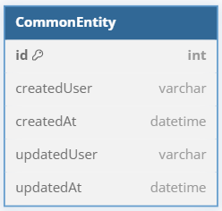
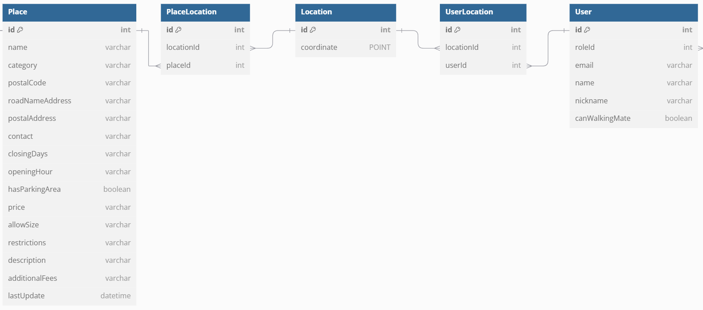
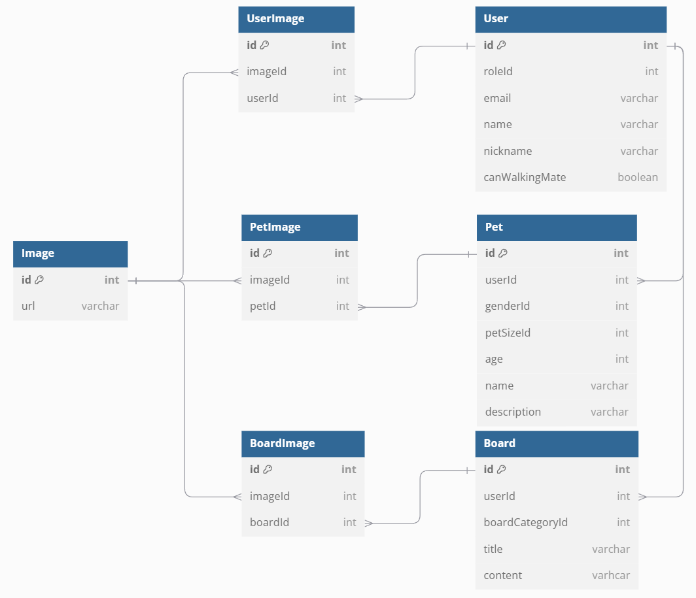
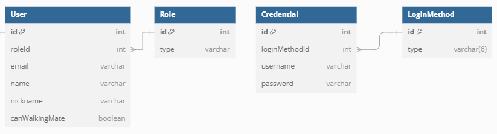
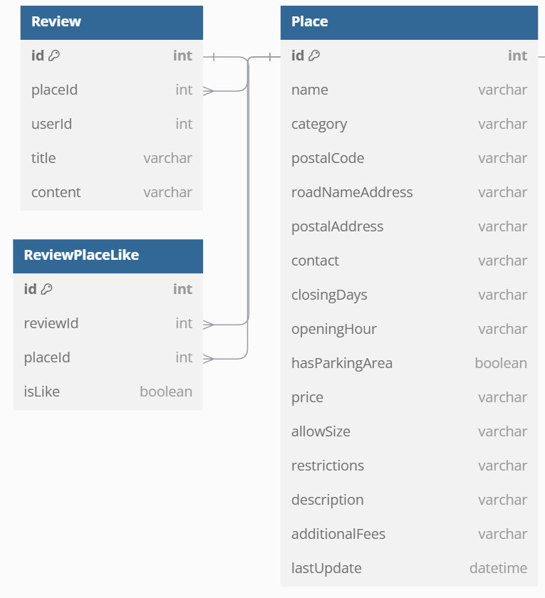
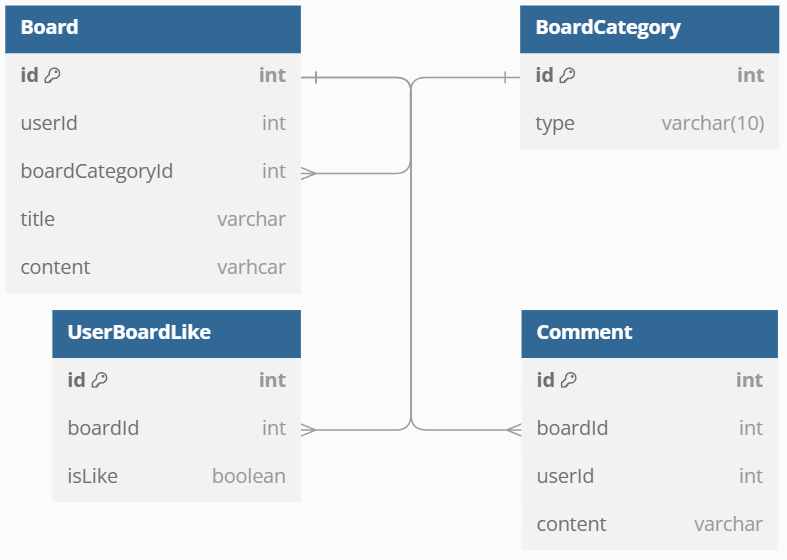
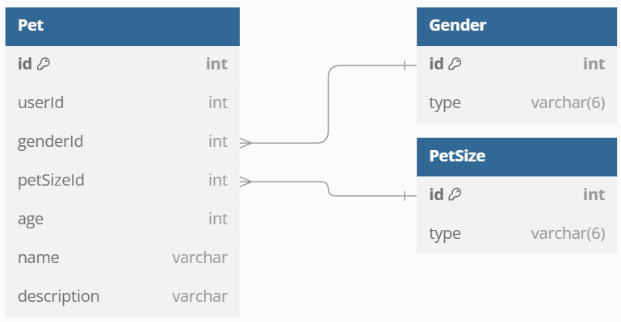
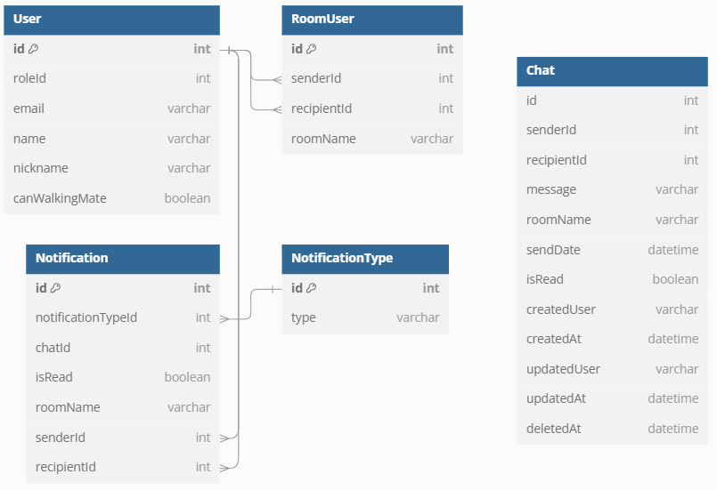

## 서비스 목적
- 반려인 커뮤니티

## 개발 인원

<table>
  <tr>
    <td align="center"><b>담당 파트</b></td>
    <td align="center" colspan="2">백엔드</td>
    <td align="center" colspan="3">프론트엔드</td>
  </tr>
  <tr>
    <td align="center"><b>이름</b></td>
    <td>한바울</td>
    <td>손석경</td>
    <td>이서빈</td>
    <td>이주영</td>
    <td>하정우</td>
  </tr>
</table>

## 개발 기간

- 2024.12.17 ~ 2025.01.08

## 설계 및 프로세스
- 백엔드는 공공데이터포털에서 반려동물 동반 입장이 가능한 시설물 21,139건의 데이터를 CSV 파일로 다운받아 DB에 삽입
    - CSV 파일 [(공공데이터포털 링크)](https://www.data.go.kr/data/15111389/fileData.do?recommendDataYn=Y#/tab-layer-openapi)
- 백엔드는 공공데이터포털에서 NestJs의 Task Scheduling(Cron) 기능을 이용하여 반려동물 동반 입장이 가능한 시설물 정보에서 하루 1000건(API 호출 제한 최대치)의 데이터를 DB에 삽입
    - REST OpenAPI [(공공데이터포털 링크)](https://www.data.go.kr/tcs/dss/selectApiDataDetailView.do?publicDataPk=15135102)

- 사용자는 위치 기반 서비스를 이용 가능 (반경 250 / 500 / 1000 (m))
    - 현재 위치를 기준으로 반려동물과 동반 가능한 시설물 조회가 가능
    - 사용자는 시설물에 대한 리뷰 작성이 가능
    - "산책메이트" 기능이 켜져있는 사용자에 한해 위치 정보(WGS84, SRID 4326)를 수집 및 주변 사용자 조회, 채팅 요청이 가능
    - 채팅 요청을 받은 사용자에게 socket을 통한 알림을 표시하며 수락시 상호 채팅이 가능
- 사용자는 마이페이지에서 반려동물을 등록하여 커뮤니티 이용 가능

## 담당 기능
- 폴더 구조 구성 (3 Tier Architecture)
- ERD 작성 및 TypeORM Migration 구성
- Nginx Reverse Proxy 구성 및 배포
- 구현한 기능
    - 로그인 및 카카오 로그인 구현
    - 게시판 기능 구현(AWS S3 이미지 업로드를 포함한 CRUD)
    - Socket Io를 활용한 채팅 기능 구현

## ERD

### 공통 컬럼 부분

- 모든 테이블은 CommonEntity를 상속 받아 생성 및 수정한 날짜 / 사용자 조회 가능

### WGS84 (위도, 경도) 부분

- 시설물의 위치와 사용자의 위치를 저장
- Many To Many 테이블을 통해 확장이 가능
- Spatial Index 활용

### 이미지 부분

- S3에 저장한 이미지의 Url을 저장
- Many To Many Table을 통해 확장이 가능

### 사용자 정보 (계정 정보) 부분

- User 테이블에 사용자 정보 저장
- Credential 테이블에 계정 정보 저장
  - LoginMethod 테이블로 소셜 로그인을 구분하여 확장이 가능(일반, 카카오, 구글 로그인 등)

### 반려동물과 동반 입장 가능한 시설물 부분

- 시설물과 좋아요 기능을 포함한 리뷰 기능 CRUD

### 커뮤니티 부분

- 좋아요 기능을 포함한 게시글과 댓글 기능 CRUD

### 반려동물 부분

- 사용자의 반려동물 정보 CRUD

### 채팅 부분

- Chat Schema는 MongoDB에 저장했기 때문에 외래키로 연결 되어있지 않음
- RoomUser 테이블에 채팅 요청, 수락 한 사용자 그리고 채팅방 이름을 저장
- Notification 테이블에 채팅 요청 및 메세지 전송할 때 해당 정보를 이력처럼 저장
  - NotificationType은 RECEIVE_MESSAGE | INVITE 으로 나뉘어 초대요청 알림인지 메세지 수신 알림인지 구분